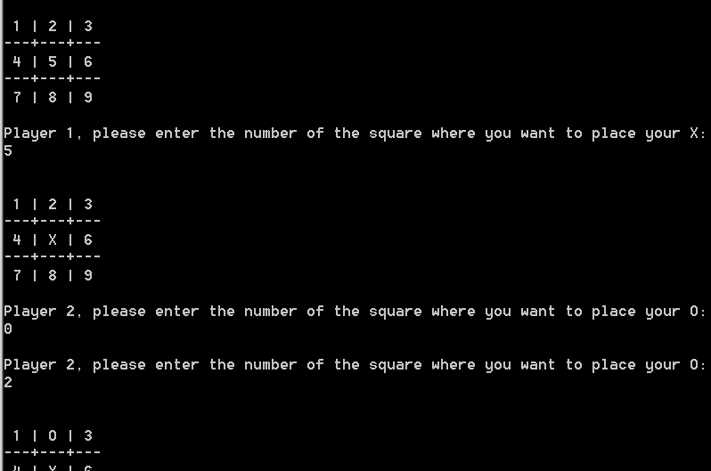

逸霄说在前面的话：为了缓和谷哥的学习曲线，建议搭配《C Primer Plus》进行学习，同时我会搭配一些轻松愉快的小练习，供大家玩耍。本篇教程大概需要花费各位两个星期的时间进行完全的消化理解。

<!-- More -->
------

久违的第二次C语言教程又要开始了~
在这之前，我在第一期教程中带着大家弄出了第一个程序。然后给出了几个需要自学才能完成的题目。不知道大家有没有努力自学并且完成呢。
如果你还没有开始自学，那么，在阅读以下内容之前，请保证对C语言的以下相关部分的了解：
了解基本的变量类型（int ,char ,float ,double）的基本含义
运算符的简单使用（加减乘除，取地址解引用，自增自减，逻辑判断）
**简单的语法（顺序，判断，循环结构）**
常用的函数的用法（printf , scanf）

这些内容的学习还是比较轻松的，通过书籍与在线文档/搜索引擎很快就能完成。

（来自逸霄的唠叨：我知道这可能有些难度，尤其是输入输出需要多加练习。在编程的初期，你可能会遇到很多各种各样的bug，可能是因为你还没有太熟悉C语言的编程模式。欢迎你在群里询问。）

为了确认你认真的阅读了第一期教程，我们来做个热身。

------

**热身**

打开你喜欢的IDE或者文本编辑器，随手写一个打印九九乘法表的小程序出来，结果应该像这样：

（逸霄的提示：首先你需要考虑一下怎么控制一样的宽度；然后你可能要写一个嵌套的for循环。如果你无法顺利完成这一步的话，意味着你还不能看第二讲，请使用一个星期的时间好好学习一下循环、条件这几大语法。这些并不难，只要好好写写小代码，就没有问题了。）

（逸霄的唠叨：关于解引用这一块，你只要明白，在变量前面加上&号，就代表取地址，比如说`b=&x;`就代表着b被赋值了x的地址。而反过来，`x`与`*b`是一样的，如果我们在地址/指针前面加上*号，那么指的就是一个对象。更多的消息请看这里：http://blog.csdn.net/synapse7/article/details/10260339）

如果你感觉上面的小程序太小儿科了，那真是太好了。我也并不想在验证你的水平上浪费太多时间。

本期的教程的主题是 变量，数组，指针，结构体。在我们的仅有的基础上讲解C语言的各种数据类型。
接下来我们步入正题。

------

**一，为什么要有那么多数据类型？**
刚刚当你打印九九乘法表的时候应该用了**整型变量**。遇到一些其他的计算问题，比如说计算商品折扣后的价格时又用了浮点类型。如果你仔细的想一想，发现用浮点类型计算只需要使用整数类型的变量时好像也没什么问题。那么C语言为什么要存在这么多数据类型?储存数字不是只需要一个浮点类型就好了吗？

（来自逸霄的唠叨：如果你写python，你会发现浮点类型被广泛应用；另外关于浮点类型的存储方式，可以参见IEEE 754标准。这将会在计算机组成原理中被系统地学到。二进制浮点数地存储并不是很精确，所以时常会出现微小的误差。）

各种不同的数据类型出现的根本原因在于，计算机的储存空间和计算能力并不是无穷无尽的。如果你是一个单机游戏爱好者，肯定会知道，许多大型游戏需要计算机的内存，CPU，显卡等达到一定标准才能玩。如果你是更高级的游戏发烧友，可能还会听说什么游戏优化做的好，什么游戏特别烧显卡等。其实这就和我们今天要讲的话题有很大关系。

深入的了解计算机底层的知识，你会了解，整数运算的速度和浮点运算的速度不相同。整数与浮点类型占用的内存空间也是不相等的。我们不讨论计算机计算能力的无聊话题。变量所占用的内存空间可以通过C语言中一个看起来像函数的运算符sizeof求出，大概像这样：

亲自动手看看，sizeof会输出类型占用的字节长度
值得一提的是，C语言中除了char这个最小的类型之外，类型的字节长度并不是一定的，这与使用的编译器以及平台有关。具体的原因在这里我们不做讨论，其实在一些底层的技术，以及开发平台无关的应用上了解这些还是相当重要的。但是这不是我们今天的主菜。

如果你需要做OJ，或者说为了考试，多上网了解一些这方面的知识。

------

**二，数组**
数组简单的讲就是许多同类型的变量放在一起。比如一个程序需要储存一个名字，这就需要一个字符数组。
`char ch='G';`
`char name[]="GYQ";`

（来自逸霄的唠叨：在一些特殊的情况下，你也可能看到数组的元素是数组，这种情况在C#中被称为交错数组。）
**关于数组的初始化，赋值操作可以去看看书，文档，查查百度。**

（来自逸霄的唠叨：这一块请务必不要跳过。关掉博文，去看一看书吧！）
值得注意的是字符串的末尾有一个**看不见的终止符**。
字符串”GYQ”由’G’，’Y’，’Q’，’\0’四个字符串组成，’\0’是空字符。没有了解的同学迅速去百度一波。

（来自逸霄的唠叨：也许你之前已经看过了类似\n, \r这样的表示方法，这些叫做转义字符。转义字符一般在你的C语言书中会有一个比较完整的表格，一般情况下只需要使用\n, \t这两种。如果你使用的教材是《现代方法》，你就会发现转义字符，编者是慢慢介绍的。）

（事实上，每一串字符串，背后都会接一个空字符，代表这个字串已经结束了。更多的讨论请看这里：http://blog.csdn.net/supreme42/article/details/7300451，如果你不明白，请**不要跳过**这一段。）

数组还有维数这个说法。比如说，你在做线性代数的…呸。。。我们换一个轻松的话题。你在做一个贪吃蛇的小游戏，需要用一个变量来储存画面，最可能的就是一个二维的字符数组了。

所有的多维数组都能转化为一维数组
`int a[3][3]={`
`{1,2,3},`
`{4,5,6},`
`{7,8,9}`
`};`
`int b[9]={1,2,3,4,5,6,7,8,9};`

（横向存储的二维数组）
转化方式就像上面那样，实际上多维数组与一维数组在计算机上的储存方式是一样的，也就是说上面那两个数组里面的数据的储存方式完全一致，多维数组的使用完全是为了**更简单的逻辑表达**。比如说我上面提到的贪吃蛇小游戏，用二维数组储存地图可以方便的使用两个索引值表示几行几列：
`map[5][3];//第6行4列`
如果是一维数组：
`map[5*LINEWIDTH+3]//看起来就像这样`

关于数组的一些复杂语法在文末附有博客。

（逸霄的唠叨：如果学完这些你感觉有些吃力的话，你可以试试看在二维数组上嵌套for循环，来锻炼自己的能力。接下来是一个小小的练习：）

------

**逸霄的小练习**

请你设计一个井字棋游戏。井字棋可能长这样：

要点：正确使用二维数组打印棋盘；判断胜利条件。

这个程序可能需要你一至两小时完成，并花费一下午的时间进行debug。但是一旦完成了这个训练，你将会明白之前学的那些东西如何贯穿到一起来。

------

**三，指针**
许多人都说指针是C语言里面最难学的地方，因为指针运算牵扯到太多的知识。就考试而言的确如此。
但实际上，普通的指针应用并不是十分复杂。
对于一个仅仅使用C/C++进行软件开发的人，因为有各种方便的东西可以使用。也许他所用到的东西就只有这个：
`/*C*/`
`SomeType *a=(SomeType*)malloc(sizeof(SomeType));`
`a->dosomething();`
`...`
`/*C++*/`
`SomeType *a=new SomeType();`
`a->dosomething();`
`...`

以上就是为一个类(结构)进行动态内存分配声明一个实例。
注：malloc是C语言用于动态内存分配的函数，参数是类型的字节长，可以直接使用sizeof运算符计算。
有关指针运算的部分，在实际应用中，大多可以使用数组下标的方法代替。

当然指针的用处并不只有这个指针是C语言中极其精髓的东西，关于指针的使用，运算规则可以查阅书籍，自行百度。

参考网站：http://www.runoob.com/cprogramming/c-pointers.html

（来自逸霄的唠叨：指针是一个庞杂的话题。在《现代方法》中，有关指针的话题聊了整整两章。我们也无法在线上课程里详细地说明，但是我们可以进行一些针对性的提点。希望你在阅读下面的模块前，已经看过了教材对应的部分。你可能一时间弄不懂全部。没关系，之后我们用得多了自然就会熟练的。）

------

**逸霄的Tips：**

1，**指针**是一个变量，其值为另一个变量的地址，即，内存位置的直接地址。就像其他变量或常量一样，您必须在使用指针存储其他变量地址之前，对其进行声明。

2，使用指针时会频繁进行以下几个操作：定义一个指针变量、把变量地址赋值给指针、访问指针变量中可用地址的值。这些是通过使用一元运算符 ***** 来返回位于操作数所指定地址的变量的值。

3，在变量声明的时候，如果没有确切的地址可以赋值，为指针变量赋一个 NULL 值是一个良好的编程习惯。赋为 NULL 值的指针被称为**空**指针。

4，我们喜欢在程序中使用指针代替数组，因为变量指针可以递增，而数组不能递增，因为**数组是一个常量指针**。（实际上如果你尝试着将数组名当作指针使用，你会发现数组名指向了数组的第一个元素。）

------

**逸霄的Tips：**

为什么说指针是C语言的精髓？（https://www.zhihu.com/question/20125963）

除去知乎dalao们回答的这些以外，我想特意指出的是，C语言是一门强大的语言，但也是一门很精炼（简陋）的语言。它没有繁多的语法糖，如同一把中国厨刀，什么都能做。与之相比，C#、Java更像是厨师机，而Python更像是一套厨刀。拥有了很多绝妙的语言特性之后，指针的存在感将会被弱化。但是不得不说，指针的使用充满了技巧。

------

**四，指针与数组**
指针与数组的复合运算，以及语法基本上算是C语言考试题中最高难度的东西了。
这里推荐几篇博客：
指针数组与数组指针：http://www.cnblogs.com/Romi/archive/2012/01/10/2317898.html
二维数组和指针：http://blog.csdn.net/iu_81/article/details/1782642

------

**逸霄的Tips：**

整个一套学下来，你可能对C的整体有了一些把握。指针需要学通是一件长期而艰苦的事情，很多人一直学不会，于是便有了其他语言（比如C++实际上削弱了指针）。如果你实在无法熟练操作指针，没关系，至少概念要明白——我们为什么需要指针，指针的工作原理是什么，我们可以透过指针做些什么。

------

**五，结构体**

因为出现事故，这里贴个博客：http://blog.csdn.net/huqinwei987/article/details/23625823
