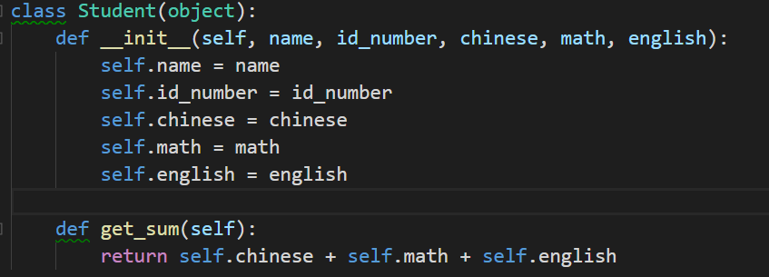

什么是OOP？

**面向对象程序设计**（英语：**Object-oriented programming**，[缩写](https://www.wikiwand.com/zh/缩写)：**OOP**）是種具有[物件](https://www.wikiwand.com/zh/对象_(计算机科学))概念的[程式編程典範](https://www.wikiwand.com/zh/编程范型)，同时也是一种程序开发的抽象方针。它可能包含[資料](https://www.wikiwand.com/zh/数据)、屬性、[程式碼](https://www.wikiwand.com/zh/源代码)與[方法](https://www.wikiwand.com/zh/方法_(電腦科學))。对象則指的是[类](https://www.wikiwand.com/zh/类_(计算机科学))的实例。它将[对象](https://www.wikiwand.com/zh/物件_(電腦科學))作为[程序](https://www.wikiwand.com/zh/程序)的基本单元，将程序和[数据](https://www.wikiwand.com/zh/数据)[封装](https://www.wikiwand.com/zh/封裝_(物件導向程式設計))其中，以提高软件的重用性、灵活性和扩展性。

<!-- More -->

面向对象程序设计可以看作一种在程序中包含各种独立而又互相调用的对象的思想，这与传统的思想刚好相反：传统的程序设计主张将程序看作一系列[函数](https://www.wikiwand.com/zh/函数)的集合，或者直接就是一系列对电脑下达的指令。面向对象程序设计中的每一个对象都应该能够接受数据、处理数据并将数据传达给其它对象，因此它们都可以被看作一个小型的“机器”，即对象。

简而言之，对象就是把程序的一些函数分类进行了整合，使之更加明确灵活。

下面结合例子来讲述OOP。

------

假设我们去银行取钱，那么流程大概是这样的：

ATM机发起请求，后台接受请求并返回交易码，ATM机提示输入密码，将密码发送给后台，后台验证之后返回结果，ATM机取出现金，向后台发起记录请求，后台更新账户信息，并且增加交易记录，用户取钱。

在这个流程中我们牵涉到了四个实体：人类，ATM机，后台，账户。

ATM机负责一系列操作，后台负责另外一些操作，对象和对象之间可以相互交流信息，同时又各司其职。

基于这样思想的编程，成为面向对象的编程。现在我们来看一个编程上的实例：

学生有语文、数学、英语成绩，有学号和姓名，还需要一个相关的函数来计算他的总分。

分析下来，我们可以构建出一个学生类。

这个类，拥有一些属性：语文、数学、英语，学号、姓名，还拥有一个方法：计算成绩。

这个框架定下来之后，我们就构建好了一个类。将这个类实例化，比如一个叫小明的同学，就是一个对象。对象和类是抽象和具体的关系，类是抽象的，是一类事物将特征提取出来的概括性的描述，而对象是具体到了某一个事物。

------

现在我们来构建这个类：

类有两种成员：属性和方法。

`class`后面紧接着是类名，即`Student`，类名通常是大写开头的单词，紧接着是`(object)`，表示该类是从哪个类继承下来的，继承的概念我们后面再讲，通常，如果没有合适的继承类，就使用`object`类，这是所有类最终都会继承的类。

由于类可以起到模板的作用，因此，可以在创建实例的时候，把一些我们认为必须绑定的属性强制填写进去。通过定义一个特殊的`__init__`方法，在创建实例的时候，就把`name`，`score`等属性绑上去：

在C++中，这个方法被称为“构造函数”，在初始化一个对象的时候，要用一些必要的参数才能将其实例化。因为Python是动态语言，你也可以自由地设定类的属性。

注意到`__init__`方法的**第一个参数永远是self，表示创建的实例本身**，因此，在`__init__`方法内部，就可以把各种属性绑定到`self`，因为`self`就指向创建的实例本身。

有了`__init__`方法，在创建实例的时候，就不能传入空的参数了，必须传入与`__init__`方法匹配的参数，但`self`不需要传，Python解释器自己会把实例变量传进去。

和普通的函数相比，在类中定义的函数只有一点不同，就是第一个参数永远是实例变量`self`，并且，调用时，不用传递该参数。除此之外，类的方法和普通函数没有什么区别，所以，你仍然可以用默认参数、可变参数、关键字参数和命名关键字参数。
