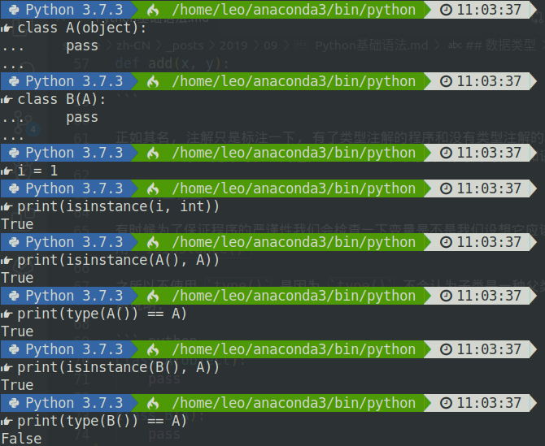
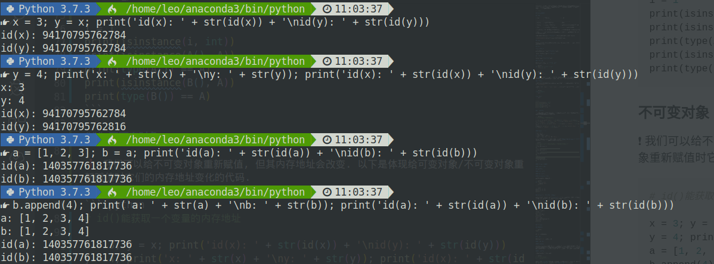
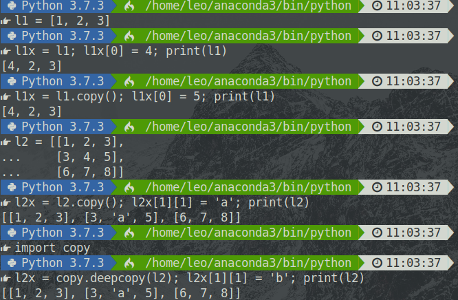
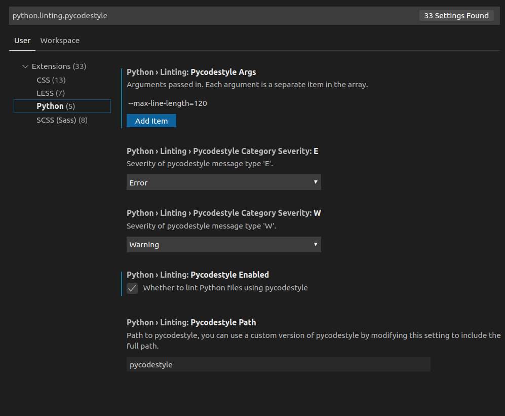

2019Python学习小组持续更新博客二, 这篇文章列出了一些我认为Python学习者应当知道的一些基础内容

<!-- More -->

## Python解释器

## 实现

| 版本       | 实现方式                   | 特点                                                    |
| ---------- | -------------------------- | ------------------------------------------------------- |
| CPython    | C语言写的Python            | 速度快                                                  |
| JPython    | 由Java编写的Python         | 可以直接调用Java的各种函数库                            |
| PyPy       | 由rPython编写的Python      | 更灵活, 易于使用和试验                                  |
| IronPython | 以. NET和Mono实现的Python  | 面向NET和ECMA CLI的Python实现                           |
| ZhPy       | 只是把Python翻译了一遍而已 | 又称中蟒, 可以完全用中文编程. 但中蟒目前已经停止更新了. |

我们通常所说的Python是**CPython**, 👇Python官方页面提供的是CPython


## 版本

Python这种语言有**Python2**和**Python3**两个版本, 两者语法有少许不同, 比如Python2和Python3中`print()`的使用有区别, Python2和Python3中`input()`接受的数据类型有区别等.

最新的Python2对大部分Python2, 3不同的语法做了兼容, 而在Python3对Python2的语法兼容性很差, 但是提供了一个叫[2to3](https://docs.python.org/zh-cn/3.7/library/2to3.html)的脚本帮助我们将Python2的程序转换为Python3的程序.

## 哲学

**万物皆对象**

python在设计初始是一种**面向对象**语言.

💡 面向对象是一种**编程范式**

## 数据类型

Python是一门**动态类型**语言

### 类型注解

在Python3中有了一个新特性: **类型注解**

```python
def add(x:int, y:int) -> int:
    return x + y
```

```python
def add(x, y):
    return x + y
```

正如其名, 注解只是标注一下, 有了类型注解的程序和没有类型注解的程序运行起来没有区别, 但它能帮助程序员更好的发现问题, 也能让IDE提供更准确的代码补全和语法检查.

### 类型检查

有时候为了保证程序的严谨性我们会检查一下变量是不是我们设想它应该是的类型, 这个时候我们用 `isinstance()`

之所以不使用 `type()` 是因为 `type()` 不会认为子类是一种父类类型, 不考虑继承关系. 举例说明:



### 不可变对象

❗️ **我们可以给不可变对象重新赋值, 但其内存地址会改变**. 以下是体现给可变对象/不可变对象重新赋值时它们的内存地址变化的例子.

💡 `id()`能获取一个变量的内存地址



#### Number (数字)

- int (整数)
- long (长整数)
- float (浮点数, 即小数)
- bool (布尔值, 即 `True` 和 `False` )

Python中的Number我认为是比较特殊的, 因为它**在内存中占用的空间大小是变动**的.(在CPython中是如此, 但不知道为什么在IronPython下不是)

💡 用`sys.getsizeof()`可以知道一个变量的占用的内存大小


#### String (字符串)

#### Tuple (元组)

### 可变对象

可变对象可能带来的危险举例:

```python
def myfunc(l = []):
    l.append('add')
    print(l)


myfunc([1, 2, 3])
myfunc([1, 2, 3])
myfunc()
```

#### List (列表)

💡 **string**和**tuple**都是特殊的**list**

#### Set (集合)

#### Dictionary (字典)

👇 在网上偷的**string, tuple, list, dictionary的突出区别比较**.

| 名字       | 是否可变 | 是否可迭代 | 是否可切片 | 访问方式   | 写法举例                 |
| ---------- | -------- | ---------- | ---------- | ---------- | ------------------------ |
| string     | no       | yes        | yes        | 下标索引   | “abcd”                   |
| tuple      | no       | yes        | yes        | 下标索引   | (‘a’,‘b’,‘c’,‘d’,‘abcd’) |
| list       | yes      | yes        | yes        | 下标索引   | [‘a’,‘b’,‘c’,‘d’,‘abcd’] |
| dictionary | yes      | yes        | no         | 关键字索引 | {‘1’:‘a’,‘2’:‘b’}        |


### Python中有关对象需要注意的问题

python中向函数传递参数只是**引用传递**: 如果参数为可变对象, 在函数中变化会影响引用的这个变量, 而不可变对象不会. 在向类传递参数时也是如此.



## 基础语法

### Python内置帮助文档

```python
help()
```

调用`help()`后就会进入Python内置帮助文档, 然后输入想查的类名/函数名/属性名就可以看到对应的帮助文档.

:bulb: 要注意输入的只有名字, 不带括号什么的, 以及要看一个包里的函数文档时需要先引用该包. 比如如果想查看**time.time()**的帮助文档, 首先`import time`, 然后输入`help()`进入帮助文档, 然后输入`time.time`, 就会看到**time.time()**函数的帮助文档. 按一次<kbd>q</kbd>退出**time.time()**的文档, 再按一次<kbd>q</kbd>退出帮助文档返回交互式Python界面.

### 注释

在Python中 `#` 开头的为注释

#### 特殊注释

##### shebang

shenbang (hashbang) 指的是以 `#!` 开头的语句. Linux操作系统的程序加载器会分析 Shebang 后的内容，将这些内容作为解释器指令，并调用该指令，并将载有 Shebang 的文件路径作为该解释器的参数. 因为在很多语言中以 `#` 开头的是注释, 所以不会影响程序.

##### 编码格式

有的python文件是这么开头的:

```python
#! /usr/bin/python
# -*- coding:utf-8 -*-
```

第一行是给**Linux系统**的程序加载器看的, 因此在Windows下不需要这句, 第二句是指定文件的编码格式为**UTF-8**, 避免文件中的**非ASCII字符**被识别为乱码.

##### docstring

```python
def func(int x, int y):
    """
    这里是docstring, 是特殊的注释, 能让IDE, 编辑器在鼠标移动到有docstring的函数, 类上时显示这段docstring
    """
    pass
a = func(i)
```

### 条件语句及循环

#### if, elif, else

下面是按a < 10, 10 < a < 20, 20 < a < 30, a > 30分类的举例.

```python
if a < 10:
    pass
elif a < 20:
    pass
elif a < 30:
    pass
else:
    pass
```

另外有一种one liner会很喜欢的用法:

```python
a = 2 if 2 > 3 else 4
```

上面这句与下面这句等效.

```python
if 2 > 3:
    a = 2
else:
    a = 4
```

#### 生成器 ·迭代器·range

语法类似于[切片](#切片)

### 推导式

**推导式comprehensions**（又称解析式）, 是Python的一种独有特性.**推导式是可以从一个数据序列构建另一个新的数据序列的结构体**. 换句话说能从一组数据中求出满足条件的新数据, 比如a, b两个等长列表中都为偶数的项的乘积. 共有三种推导式, 在Python2和3 中都有支持:

- 列表推导式
- 字典推导式
- 集合推导式

列表推导式的语法:

```python
l = [output_expression for out_exp in input_list if expression]
```

使用举例:

```python
# 1
a = [i for i in range(30) if i % 3 is 0]
# 2
names = ['Bob','Tom','alice','Jerry','Wendy','Smith']
LONG_NAMES = [name.upper() for name in names if len(name)>3]
# 3
a = [x*y for x in range(1,5) if x > 2 for y in range(1,4) if y < 3]
```

### 切片

因为tuple, string其实都是特殊的列表, 所以列表, 字符串, 元组都可以进行切片.

语法: l_sliced = a[begin : end : step]

```python
l = [1, 2, 3, 4, 5, 6, 7]
l_sliced = l[1:5:2]
```

在没有**numpy**库的情况下**多维切片**是通过推导式实现的:

```python
a = [[1, 2, 3], [4, 5, 6], [7, 8, 9]]
b = [a[i][:-1] for i in range(1, 3)]
```

### 函数

💡 要注意函数名后的 `()` 也是一种运算符, 称为**函数调用运算符**. 如果调用函数的时候不加()只会创建一个该函数的对象而不会调用它.

#### 定义函数

python中以 `def` 关键字定义函数, 结构如下:

```python
def 函数名(参数列表):
    函数主体
```

python中的函数可以有返回值也可以没有返回值

```python
def func1():
    pass
def func2(l):
    l.appeend('add')
def func3(x, y):
    return x + y
```

### 用字典来实现case

示例:

```python
def print1():
    print('111')


def print2():
    print('222')


def printdefault():
    print('default')


dic = {
    'a': print1,
    'b': print2,
	'default': printdefault}

i = input('input: ')
main = dic[i if (i != 'a' or i != 'b') else 'default']
main()
```

### 编码格式

字符串经过**编码（encode）** 就成为了一堆数据, 反过来, 数据经过**解码（decode）** 就变回我们认识的字符串.


指定文件编码格式为 `utf-8`

```python
# -*- coding:utf-8 -*-
```

:bulb: 如果不指定文件编码格式在有的Python2版本中无法识别中文, 即便是中文注释也会报错.


Linux系统默认编码格式是**UTF-8**, 系统语言是简体中文时Windows10的编码格式是**GB2312** (也称GBK, 国标扩展, cp936)

在python中 `str` 类型数据都以Unicode码点格式储存, 因此直接打印字符串会看到字符为'\u'开头

### 基本读写

```python
f = open("test.txt", "r+")
f.read()
f.write("text")
f.close()
```

或者

```python
with open("test.txt", "r+") as f:
    f.read()
    f.write("test")
```

💡 **使用with语句打开文件是最推荐的方式**, 原因见[这里](https://www.cnblogs.com/ymjyqsx/p/6554817.html)

下表是open时要指定的读写模式的比较.

| 读写模式 | 是否可读 | 是否可写 | 文件指针位置 | 作用                                       |
| -------- | -------- | -------- | ------------ | ------------------------------------------ |
| r        | 是       | 否       | 文件开头     | 读取文件, 如果文件不存在则报错             |
| r+       | 是       | 是       | 文件开头     | 读取并写入文件, 如果文件不存在则报错       |
| w        | 否       | 是       | 文件开头     | 覆写原文件, 如果文件不存在则创建           |
| w+       | 是       | 是       | 文件开头     | 读取并覆盖写原内容, 如果文件不存在则创建   |
| a        | 否       | 是       | 文件末尾     | 追加文件内容, 如果文件不存在则报错         |
| a+       | 是       | 是       | 文件末尾     | 追加文件内容并且可读, 如果文件不存在则报错 |

另外还有`b`模式, 以二进制打开, 允许我们对二进制文件进行编辑, `b`可以与其他模式组合使用, 比如
`rb`

🔗 [python基础-文件读写'r' 和 'rb'区别](https://www.cnblogs.com/nulige/p/6128948.html)

## 脚本和普通程序的区别

脚本这个词来源于戏剧, 能用于舞台演出的戏剧文本就称为**脚本**. 在编程中的脚本是解释执行的程序, 通常只用来做简单的处理, 做自动化处理

## 解释器的使用技巧

在解释器中交互式编程时要注意缩进不要错

### 清屏

python解释器本身没有清屏命令, 只能通过调用命令行的清屏命令来达到效果

```python
import os
# Windows下
os.system('cls')
# Linux下
os.system('clear')
```

## 代码风格

我推荐遵从[PEP8](https://www.python.org/dev/peps/pep-0008/). 当然一行一行看完这个规范不是一件令人愉快的事, 最简单的时刻遵守PEP8的方式是在代码工具里安一个**代码风格检查器** (linter).
检查你的代码是否符合PEP8的linter是[pycodestyle](http://pycodestyle.pycqa.org/en/latest/intro.html)

💡 在VSC中可以在设置中搜索**python.linting.pycodestyle**, 勾选**Pycodestyle Enabled**, 这样在VSC中编写Python代码时使用的linter就是pycodestyle啦


